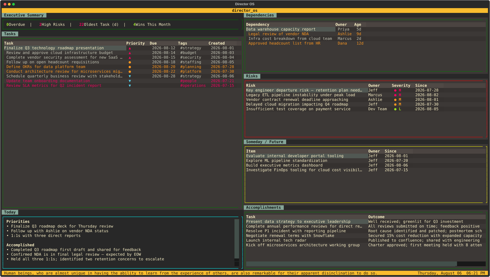

# director_os

A terminal-based operating system for technology leaders. Built with [Textual](https://github.com/Textualize/textual).

## Overview

director_os is a terminal-based productivity system designed for technology leaders who need to track tasks, dependencies, risks, and decisions without the overhead of a heavyweight tool.

Most productivity apps store your data in proprietary databases or cloud services — making it difficult to export, search, or own your own history. director_os takes a different approach: everything is stored in plain markdown files, one per month. Your data is readable in any text editor, searchable with standard tools, version-controllable with git, and portable across machines. There is no sync service, no account, and no lock-in.

The tradeoff is intentional. This is a tool for people who want to stay close to their data and work in a terminal.

director_os is not a note-taking app, a time tracker, or a project management suite. It is a low-friction way to manage your work, stay on top of what matters, and report out on status and accomplishments — without leaving the terminal.

## Features

- **Executive Summary** — live status bar showing tasks, overdue count, waiting-on count, oldest dependency age, high risk count, and wins this month — color-coded red/green by health
- **Task tracking** — add, edit, complete, delete, and reopen tasks with priority (A/B/C), due dates, and tags — priority shown as color-coded glyphs (▲/●/▼), rows age-colored after 7/14 days
- **Dependency tracking** — track what you're waiting on, by owner and age
- **Risk tracking** — log risks with severity (H/M/L), owner, and date — severity color-coded in the dashboard
- **Someday / Future** — capture ideas and future work; promote to active tasks with full metadata (`p`), or move tasks to someday (`S`)
- **Accomplishments** — auto-logged when tasks are completed, editable, reopenable; flag with `m` to surface in manager updates
- **Manager update** — generate a structured bullet update since a given date (defaults to last Monday); filter by `★` flagged items or show all; written to `updates/` in your logs directory
- **Daily check-in** — structured daily log with priorities, accomplished, blocked, and notes
- **Daily log navigator** — browse and review past daily log entries
- **Today panel** — shows today's check-in priorities, accomplished, and blocked at a glance
- **Weekly review** — structured weekly summary with accomplishments, open tasks, and notes
- **Calendar** — Gregorian and NRF 4-5-4 fiscal calendar view with due date, check-in, and event markers; navigate months and fiscal periods
- **Events** — track holidays, deadlines, OOO, and other events with configurable reminders; notifications appended to daily log on launch
- **Tag manager** — rename and merge tags across all objects
- **Widget viewer** — press `v` on any table to open a full-screen read-only expanded view
- **Monthly log files** — one markdown file per month, auto-scaffolded and rolled over with open tasks and dependencies carried forward; rolled-over tasks marked with `↩`
- **Log sync** — push logs to any git remote from the dashboard with `g`; auto-syncs silently on quit; toast confirms success or shows error
- **Help** — grouped keyboard shortcut reference by widget/screen area; two-column layout

## Screenshot



## Layout

```
┌─────────────── director_os ───────────────────────────────┐
│  Executive Summary                                        │
│  [metrics bar]                                            │
│                          │                                │
│  Tasks                   │  Dependencies                  │
│  [task table]            │  [dependency table]            │
│                          │                                │
│  Today                   │  Risks                         │
│  [today panel]           │  [risks table]                 │
│                          │                                │
│                          │  Someday / Future              │
│                          │  [someday table]               │
│                          │                                │
│                          │  Accomplishments               │
│                          │  [accomplishments table]       │
├── [quote] ─────────────────────────── [date & time] ──────┤
```

Left column = immediate action. Right column = situational awareness.

## Keyboard Shortcuts

| Key | Action |
|-----|--------|
| `a` | Add task |
| `e` | Edit selected row |
| `d` | Complete task |
| `u` | Reopen accomplishment as task |
| `delete` | Delete selected row |
| `!` | Daily check-in |
| `W` | Weekly review |
| `t` | Tag manager |
| `w` | Add dependency |
| `x` | Resolve dependency |
| `i` | Add risk |
| `s` | Add someday item |
| `S` | Move focused task to someday |
| `p` | Promote someday item to task (opens form for metadata) |
| `l` | Open daily log navigator |
| `c` | Calendar (Gregorian + NRF fiscal) |
| `E` | Events |
| `v` | View focused widget full-screen |
| `r` | Refresh data + new quote |
| `m` | Flag task/accomplishment for manager update (`★`) |
| `U` | Manager update generator |
| `g` | Sync logs (git add/commit/push); auto-syncs on quit |
| `?` | Help (grouped by widget/screen) |
| `q` | Quit |

## Log Format

Logs are stored as markdown files in `YYYY-MM-Director-Log.md`. Each month auto-scaffolds with sections for tasks, dependencies, risks, someday items, accomplishments, and daily log entries. Open tasks and dependencies are carried forward on rollover. Events are stored separately in `events.md`.

The log directory is configurable — copy `config.toml.example` to `config.toml` and set `logs_path` to any local or synced directory (e.g. a private git repo, OneDrive folder). If the path is missing on startup, a clear error screen is shown.

## Built With AI Assistance

This project was developed with the help of AI coding assistants. Initial scaffolding and early features were built using [GitHub Copilot](https://github.com/features/copilot). The majority of the architecture, feature development, and refinement was done in collaboration with [Amazon Q Developer](https://aws.amazon.com/q/developer/), which proved to be the more robust and impactful tool for this kind of iterative, context-heavy development.

## Configuration

Copy `config.toml.example` to `config.toml` and set your logs path:

```toml
logs_path = "/path/to/your/logs"
```

`config.toml` is gitignored — each machine has its own. The app falls back to `logs/` if no config is present.

## Running

```bash
pip install -r requirements.txt
cp config.toml.example config.toml  # then edit logs_path
python app.py
```
