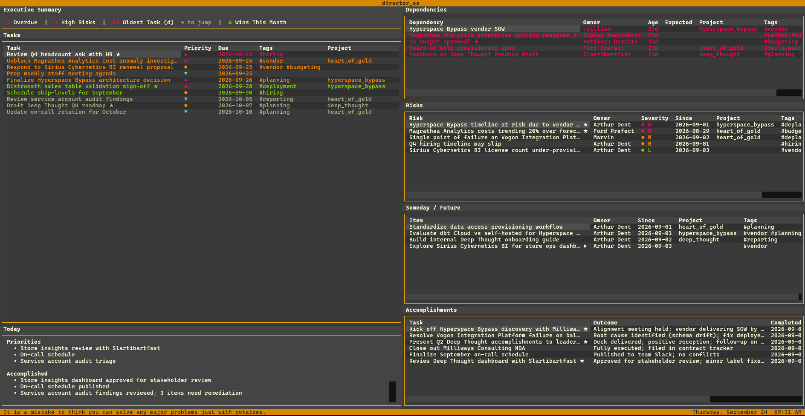
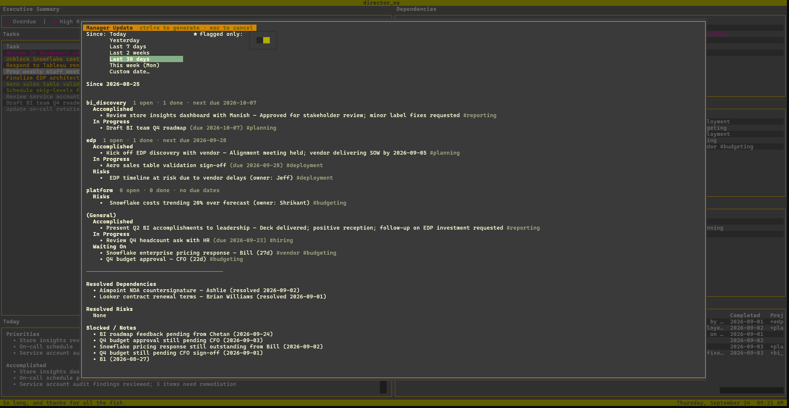
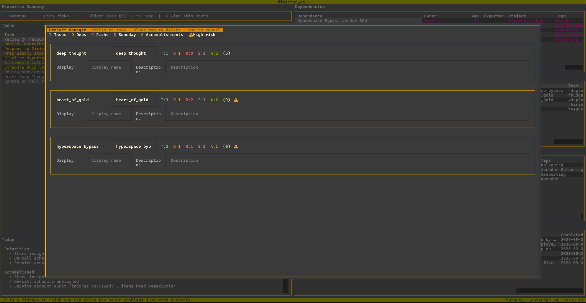
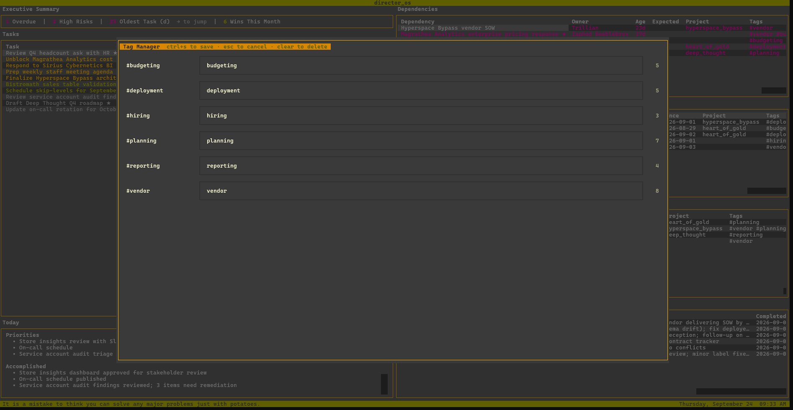
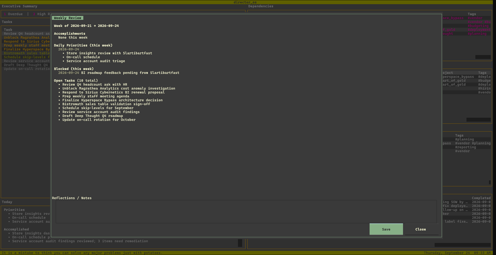
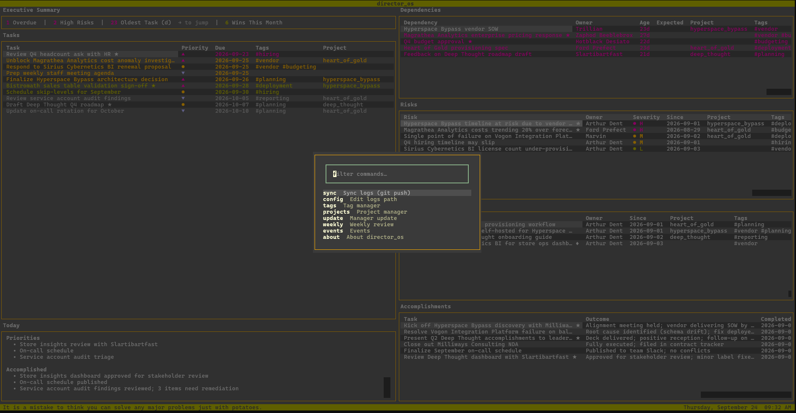
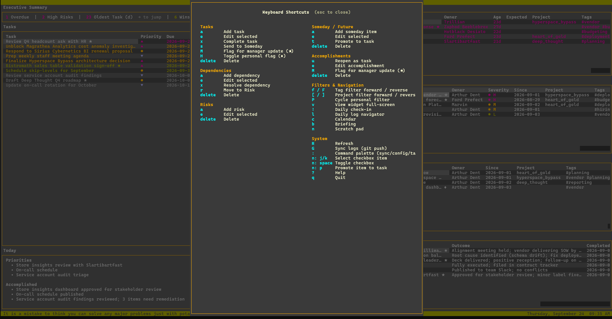

# director_os

A terminal-based productivity OS for technology leaders. Built with [Textual](https://github.com/Textualize/textual).

director_os is a low-friction way to manage your work, stay on top of what matters, and report out on status and accomplishments — without leaving the terminal. All data is stored in plain markdown files, one per month. No database, no sync service, no lock-in.

## Screenshots


*Main dashboard — tasks, dependencies, risks, someday, accomplishments, and today's check-in*


*Manager update — project-grouped with programmatic summary, outcomes, and tags*


*Project manager — per-type counts, high-risk indicator, display name and description*


*Tag manager — rename, merge, and delete tags across all objects*


*Weekly review*


*Command palette*


*Keyboard shortcut reference*

## Features

- **Executive Summary** — live status bar showing overdue count, high risk count, oldest task age, and wins this month
- **Task tracking** — add, edit, complete, delete, and reopen tasks with priority (A/B/C), due dates, tags, and project
- **Dependency tracking** — track what you're waiting on, by owner and age; hand off from completed tasks
- **Risk tracking** — log risks with severity (H/M/L), owner, date, tags, and project
- **Someday / Future** — capture ideas and future work; promote to active tasks or demote tasks to someday
- **Accomplishments** — auto-logged when tasks are completed; carries tags, project, and flags forward; add standalone accomplishments directly; flag with `M` to surface in manager updates
- **Project tracking** — tag any item with a project (`Project: name`); filter the entire dashboard by project with `]`/`[`; `0` clears all filters
- **Tag filtering** — filter the entire dashboard by tag with `f`/`F`; tags and projects apply across all object types
- **Manager update** — generate a project-grouped update since a given date (supports shorthands: `y`, `-7`, `-2w`, `lw`); programmatic summary per project (open · done · next due); accomplished bullets show outcome; tags on all bullet types; includes resolved deps and risks; written to `updates/`
- **Project manager** — rename projects, set display name and description used in manager updates; color-coded per-type counts; high-risk indicator
- **Daily check-in** — structured daily log with priorities, accomplished, blocked, and notes
- **Today panel** — shows today's check-in at a glance
- **Weekly review** — structured weekly summary
- **Calendar** — Gregorian and NRF 4-5-4 fiscal calendar with due date and event markers
- **Events** — track holidays, deadlines, OOO with configurable reminders
- **Personal flag** — mark items as personal (♦); cycle dashboard between All / Personal / Work views
- **Scratch pad** — persistent markdown scratch pad with checkbox navigation and promote-to-task
- **Tag manager** — rename and merge tags across all objects
- **Calendar agenda** — export your Outlook (or any) calendar as `.ics` and surface today's meetings in the Today panel; re-export daily to keep current; requires `icalendar` (`pip install icalendar`); optional — app works without it
- **Meeting analysis** — `analyze_calendar.py` script for monthly meeting trends: total time, avg per day, by weekday, by week, busiest days, top recurring meetings; requires `recurring-ical-events` (`pip install recurring-ical-events`); reads `calendar_history_ics_path` from `config.toml`
- **Log sync** — push logs to any git remote with `G`; auto-syncs on quit
- **Plain text log format** — pipe-delimited named fields (`Field: value`) across all object types; human-readable and easily parsed

Press `?` in the app for a full keyboard shortcut reference.

## Installation

```bash
pip install -r requirements.txt
cp config.toml.example config.toml  # then edit logs_path
python app.py
```

`icalendar` is an optional dependency — only needed if you want calendar agenda in the Today panel. The app runs without it.

## Configuration

Set your paths in `config.toml`:

```toml
logs_path = "/path/to/your/logs"

# Optional: ICS calendar export for Today panel agenda (re-export daily)
calendar_ics_path = "/path/to/outlook_calendar.ics"

# Optional: wider ICS export for analyze_calendar.py (re-export as needed)
calendar_history_ics_path = "/path/to/outlook_calendar_history.ics"

# Optional: set terminal size on launch
# terminal_size = [220, 50]
```

`config.toml` is gitignored — each machine has its own. The app falls back to `logs/` if no config is present. All config fields are editable via `:config` in the app.

## Built With AI Assistance

This project was developed with the help of AI coding assistants. Initial scaffolding and early features were built using [GitHub Copilot](https://github.com/features/copilot). The majority of the architecture, feature development, and refinement was done in collaboration with [Amazon Q Developer](https://aws.amazon.com/q/developer/), which proved to be the more robust and impactful tool for this kind of iterative, context-heavy development.
